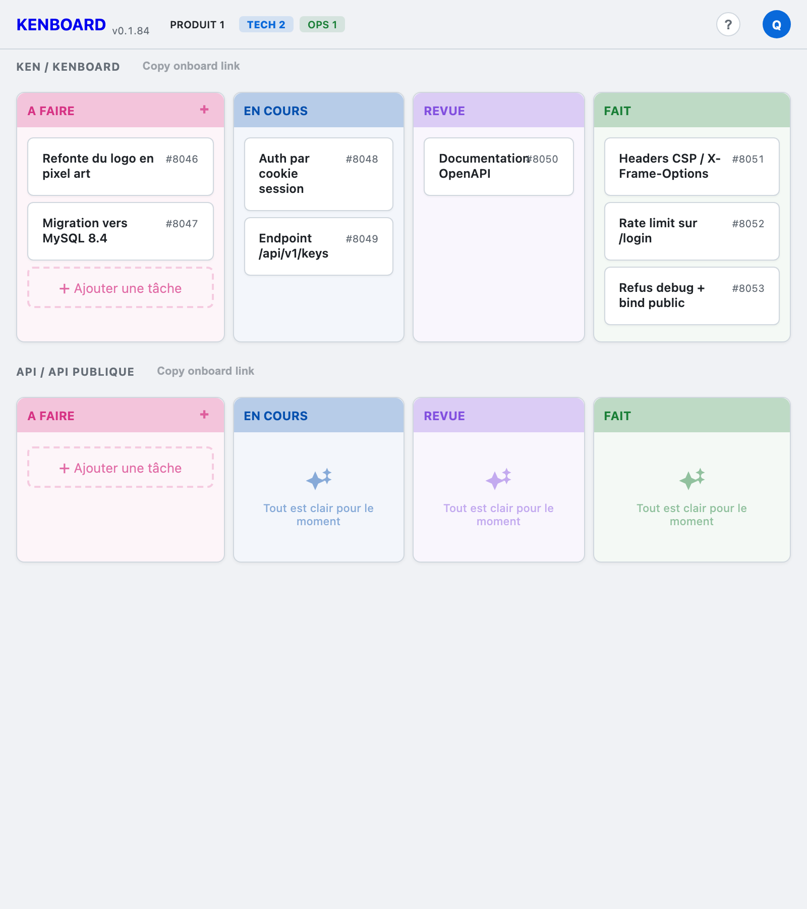

# KENBOARD

> **Un kanban pour les BOT.**

[](https://pypi.org/project/kenboard/)
[](https://pypi.org/project/kenboard/)
[](https://opensource.org/licenses/MIT)
[](https://github.com/lduchosal/kenboard/actions/workflows/python-package.yml)
[](https://github.com/lduchosal/kenboard/actions/workflows/publish.yml)
[](https://codecov.io/gh/lduchosal/kenboard)
[](./interrogate_badge.svg)
[](https://sonarcloud.io/summary/new_code?id=lduchosal_kenboard)
[](https://sonarcloud.io/summary/new_code?id=lduchosal_kenboard)
[](https://sonarcloud.io/summary/new_code?id=lduchosal_kenboard)
[](https://sonarcloud.io/summary/new_code?id=lduchosal_kenboard)
[](https://sonarcloud.io/summary/new_code?id=lduchosal_kenboard)
[](https://sonarcloud.io/summary/new_code?id=lduchosal_kenboard)
[](https://sonarcloud.io/summary/new_code?id=lduchosal_kenboard)
[](https://sonarcloud.io/summary/new_code?id=lduchosal_kenboard)

<p align="center">
  
</p>

## Usage pour les humains

<p align="center">
  
</p>

> Régénérer le screenshot après une évolution UI : `pdm run screenshots`

## Usage pour les BOT

KENBOARD livre `ken`, une CLI pensée pour Claude Code et autres assistants :
output JSON, filtres natifs, exit codes propres.

```sh
# Une fois par dossier : lier le repo à un projet KENBOARD
ken --base-url https://kenboard.example.ch init <project-id>

# Workflow quotidien
ken list --status doing --who Claude       # tâches en cours assignées au bot
ken add "Fix login redirect" --who Claude  # créer
ken move 42 --to review                    # déplacer
ken done 42                                # clôturer
```

Référence complète de la CLI : [`doc/ken-cli.md`](doc/ken-cli.md).
Pour les cas non couverts par `ken` (categories, users, delete), l'API REST
reste disponible : [`doc/api.md`](doc/api.md), [`doc/openapi.yaml`](doc/openapi.yaml).

## Entreprise

KENBOARD est concu pour un deploiement self-hosted en entreprise :

- **Authentification OIDC** — connexion via un Identity Provider
  d'entreprise (Microsoft ADFS, Google Workspace, Authentik, Keycloak,
  etc.) en complement ou remplacement du login par mot de passe.
  Voir [`doc/oidc-adfs.md`](doc/oidc-adfs.md) pour le guide ADFS.
- **Self-hosted** — aucune dependance cloud. MySQL + Flask + gunicorn
  sur votre infrastructure, derriere votre reverse proxy / WAF.
- **API keys par projet** — chaque agent ou integration recoit un
  token scope (read/write) sur un projet specifique. Les agents IA
  s'auto-onboardent via le runbook servi par le serveur.
- **Support commercial** — accompagnement a la mise en place,
  integration IdP, et support operationnel disponibles sur demande.
  Contact : [2113.ch](https://www.2113.ch)

## Installation

Voir [`INSTALL.md`](INSTALL.md) pour la mise en place complète (MySQL, utilisateurs, migrations, reverse proxy, OIDC).

## Licence

MIT — voir [`LICENSE`](LICENSE).

